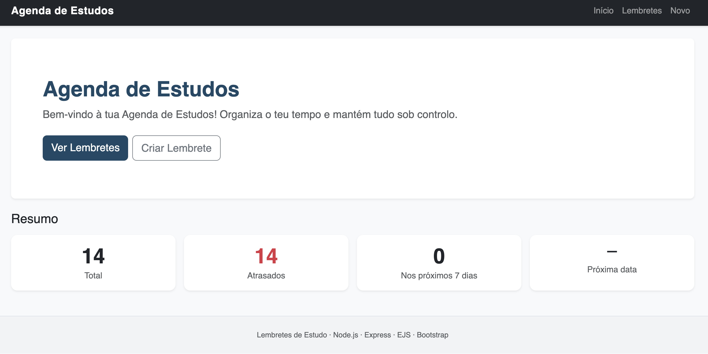
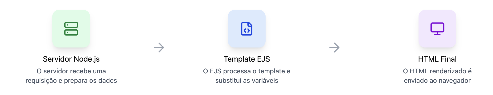
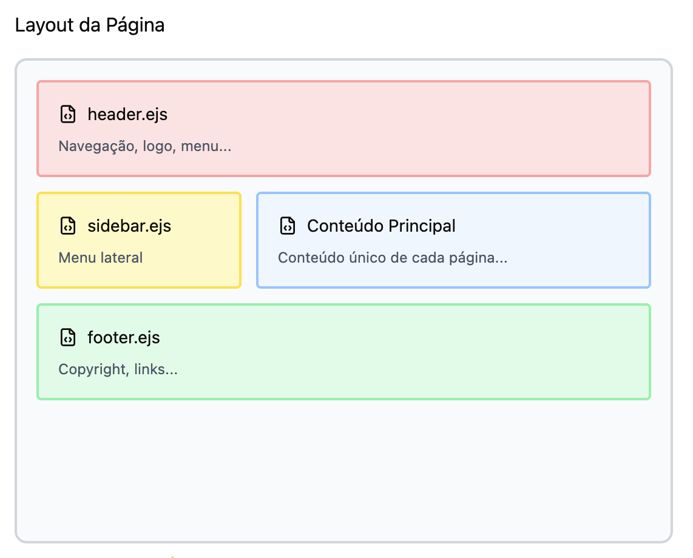
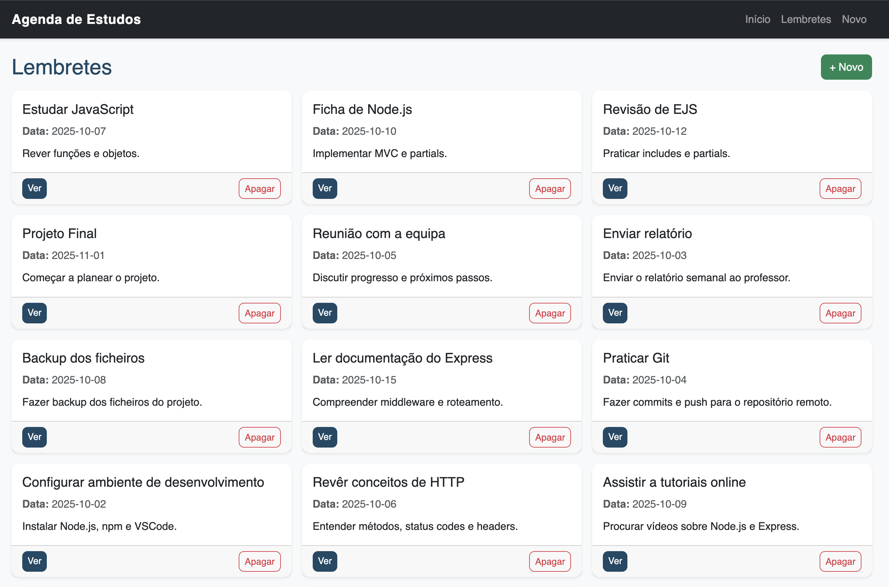
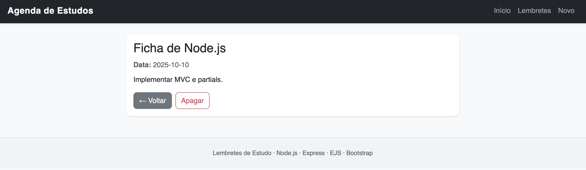
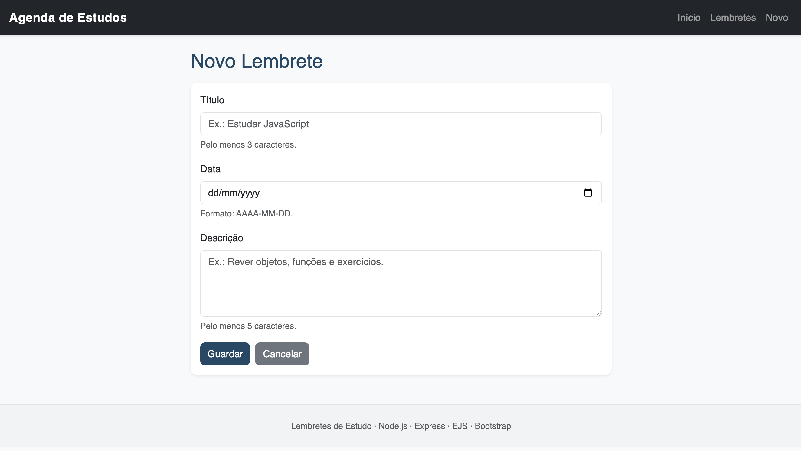

# Ficha 2 - Web app de Lembretes

**Dados rápidos**

-   **Turma:** 12º ano de Informática de Gestão
-   **Conteúdo:** Node.js, Express, EJS, MVC, rotas, controladores, middlewares
-   **Objetivo:** construir um servidor web MVC simples com Node.js, Express e EJS, usando dados simulados.
-   **Template:** Está disponível no repositório dado nas aulas, um template com pastas criadas, partials EJS, CSS e o ficheiro `src/data/lembretes.js` pré-preenchido. Podes começar pelo template em GitHub Codespaces (botão “Code” > “Create codespace”) ou clonar no VS Code (`git clone <URL_DO_REPO_DA_TURMA>`, depois `npm install` e `npm start`).

    <br>

**Entrega:** submete o link do repositório GitHub com o teu código até à data limite **30 de novembro de 2025**.

<br>


_Figura 1: A página principal da Agenda de Estudos, com resumo de lembretes._

<br>

## Índice

-   [Teórica](#te%C3%B3rica)
-   [Tutorial passo a passo](#tutorial-passo-a-passo)
-   [Exercícios](#exerc%C3%ADcios)
-   [Changelog](#changelog)

---

## Teórica

### Node.js

-   Node.js é um runtime environment: permite correr JavaScript fora do navegador, no servidor.
-   Usa o motor V8 do Chrome embalado, juntando módulos e APIs do sistema operativo (ficheiros, rede, processos…).
-   Serve para criar servidores web, manipular ficheiros/BD, automatizar scripts ou até construir apps desktop.

### Estrutura interna simplificada

-   Motor V8 (Google): executa JS e converte para código de baixo nível.
-   libuv: event loop e I/O assíncrono (ficheiros, rede, timers).
-   APIs do Node: módulos internos disponíveis via JS.

### Modelo de execução do Node.js

-   Single-threaded: há um único main thread a correr o teu JS; tarefas demoradas são delegadas a threads internas da libuv.
-   Nota: uma thread é uma linha de execução de um programa. Com uma única thread principal, só se faz uma coisa de cada vez no JS; outras threads internas tratam do I/O pesado.
-   Event-driven: o Node vive de eventos e callbacks. Quando uma operação termina, a callback associada é colocada na event queue para correr quando o main thread estiver livre.
-   Evento: algo que acontece (ficheiro lido, pedido recebido). Callback = função passada como argumento e chamada mais tarde, quando o evento ocorre.
-   Exemplo de callback:

    ```js
    function executarDepois(acao) {
        setTimeout(() => {
            console.log("Operação terminada.");
            acao();
        }, 2000);
    }
    ```

-   Non-blocking I/O: operações de entrada/saída (ficheiros, HTTP…) são assíncronas; o programa não fica preso à espera.

### Event loop - o coração do Node

-   O event loop percorre continuamente as filas de eventos, microtasks e timers, despachando callbacks quando o main thread está livre.
-   Em resumo: mantém o servidor vivo enquanto houver eventos pendentes (ex.: pedidos HTTP).

### O que acontece ao correr um servidor Node.js

1. O Node carrega o motor V8.
2. Lê o ficheiro de arranque (ex.: `index.js`).
3. Converte JS em bytecode/código máquina.
4. Cria o ambiente global (`global`, `process`, `__dirname`…).
5. Executa o código síncrono.
6. Reencaminha tarefas assíncronas para a event loop.
7. Mantém-se ativo enquanto houver pedidos/eventos.

### Pacote HTTP

-   Um pacote HTTP é a mensagem trocada entre cliente (browser) e servidor.
-   Pedido HTTP (Request) - enviado pelo cliente:
    -   Linha de pedido: método + endereço.
    -   Cabeçalhos (headers): info extra (idioma, tipo de dados, cookies…).
    -   Corpo (body): dados enviados (normal em POST/PUT).
-   Resposta HTTP (Response) - enviada pelo servidor:
    -   Linha de estado: sucesso/erro.
    -   Cabeçalhos.
    -   Corpo: conteúdo devolvido.

### Express.js

-   Framework minimalista em cima do módulo `http` do Node.
-   Abstrai cabeçalhos e parsing manual, oferecendo:
    -   Roteamento simples (`get`, `post`, `put`, `delete`).
    -   Middlewares (camadas antes/depois das rotas).
    -   Motores de vistas (EJS, Pug…).
    -   Acesso facilitado a `req.body`, `req.params`, `req.query`, cookies, estáticos.
-   Base para estruturar apps em módulos: routers, controladores e modelos (MVC).
-   Por baixo, o Node continua a ser o servidor base; o Express apenas organiza e abstrai o tratamento dos pedidos HTTP.

### Middlewares

-   Função com assinatura `(req, res, next)`.
-   Pode ler/modificar pedido/resposta e depois chamar `next()` para continuar.
-   No Express são processados sequencialmente na ordem em que são registados.

### Rotas e métodos HTTP

-   Uma rota liga método + caminho a uma função (controlador).
-   Métodos principais: `GET` (ler), `POST` (criar), `PUT` (atualizar), `DELETE` (apagar).
-   À medida que a app cresce, as rotas são separadas por áreas usando `express.Router()`.
-   Estrutura comum: rota principal no `app.js` e sub-rotas em ficheiros próprios.

### Como o Express gere rotas internamente

1. Mantém uma lista ordenada de todas as rotas registadas.
2. Quando chega um pedido, lê método e caminho.
3. Procura a primeira rota que corresponda.
4. Executa a função associada (callback/controlador).

### Os objetos `req` e `res`

-   `req.method`, `req.url`, `req.params`, `req.query`, `req.body` (após `express.urlencoded()` ou `express.json()`), entre outros.
-   `res.render`, `res.send`, `res.status`, `res.redirect`, etc., para construir a resposta.

### Controladores e MVC

-   Controlador: reúne a lógica a executar quando uma rota é chamada.
-   MVC:
    -   Model: gere os dados (ex.: ligação BD).
    -   View: mostra o resultado ao utilizador.
    -   Controller: ponte entre Model e View.
-   Um controlador recebe o pedido (`req`), lê/modifica dados, decide a vista ou resposta a devolver (`res`).

### Embedded JavaScript Templates (EJS) e vistas


_Diagrama simplificado do fluxo de uma requisição com EJS._

<br>

-   View: ficheiro que mostra informação ao utilizador (HTML/EJS). A view não “pensa”; apenas mostra o que o controlador enviar.
-   EJS mistura HTML com JS no servidor para gerar páginas dinâmicas (ex.: listas de lembretes, mensagens personalizadas).
-   Fluxo: Rota Express → Controlador → `res.render("vista", { dados })` → EJS gera HTML puro → Browser recebe só HTML.
-   Exemplo:

```js
app.get("/", (req, res) => {
    const nome = "João";
    res.render("home", { nome: nome });
});
```

No ficheiro `views/home.ejs` poderíamos ter:

```html
<!DOCTYPE html>
<html>
    <head>
        <title>Bem-vindo</title>
    </head>
    <body>
        <h1>Olá, <%= nome %>!</h1>
    </body>
</html>
```

O browser recebe apenas:

```txt
Olá, João!
```

### Tags principais do EJS

-   `<%= %>` escreve o valor no HTML (escapado).
-   `<%- %>` escreve valor ou HTML (não escapado).
-   `<% %>` executa JS sem mostrar nada (ifs, loops).

### Partials

-   Fragmentos reutilizáveis de EJS para evitar repetição: `_head.ejs`, `_header.ejs`, `_footer.ejs`, `_alerts.ejs`, etc.
-   Incluem-se com `<%- include('partials/_header') %>`.


_Exemplo simplificado do uso de partials em EJS._

<br>

### Lógica dentro do EJS

-   Qualquer JS é válido dentro de `<% %>`: if/for/while, expressões, funções.

### Ciclo de vida de uma requisição com EJS

1. Cliente faz um pedido HTTP.
2. Express processa e chama a rota apropriada.
3. A rota aponta para o(s) controlador(es) certo(s).
4. O controlador prepara dados e coloca-os na resposta.
5. O EJS recebe dados e cria HTML misturando HTML + JS.
6. O servidor envia HTML final; o cliente recebe apenas HTML, sem o JS do servidor.

<br>

---

<br>

## Tutorial passo a passo

<br>

> **NOTA**: Ao longo deste tutorial vais ter que editar ficheiros e colocar código entre blocos de código já existentes.
> <br> O local exato onde colocar o código é indicado em cada passo através da explicação dada antes do bloco de código.
> <br> Além disso, **o local exato é marcado com o seguinte bloco de comentário**:

```js
/* ----------------------------------------------------

 🟡 🟡 ⬇ INSERIR AQUI A ** Função ** ⬇ 🟡 🟡

---------------------------------------------------- */
```

### 0) Preparação do template e ambiente

Ficheiros incluídos no template:

| Ficheiro/Pasta     | Descrição                                    |
| ------------------ | -------------------------------------------- |
| `index.js`         | Ponto de entrada do servidor (vazio).        |
| Pasta `src/`       | Onde vai ficar o código fonte da aplicação.  |
| Pasta `public/`    | Onde está o `style.css`.                     |
| `package.json`     | Dependências do node.js e scripts npm.       |
| `README.md`        | Este ficheiro com o tutorial.                |
| Pasta `src/data/`  | Pasta para dados simulados (ex.: lembretes). |
| Pasta `src/views/` | Pasta para vistas EJS (já com partials).     |

<br>

Passos iniciais:

-   Garante que tens Node.js 18+ e npm instalados.
-   Abre o template:
    -   Cria um repositório novo com base no template da ficha.
    -   Codespaces: no GitHub, clica em **Code** > **Create codespace**.
    -   VS Code local: `git clone <URL_DO_REPO_DA_TURMA>`, abrir pasta e instalar extensões recomendadas (JS/ESLint/EJS).
-   Instala dependências e arranca o servidor para testar o ponto de partida:

```bash
npm install
npm start
```

O servidor deve arrancar e fechar logo de seguida uma vez que o `index.js` ainda está vazio.

---

### 1) `index.js`: ponto de entrada do servidor

Antes de editar, lembra-te: este ficheiro só arranca o servidor, não tem rotas.

Cria/atualiza o ficheiro `index.js` com:

```js
"use strict";
const app = require("./src/app"); // importa a app Express já configurada

const PORT = 3000; // porta onde o servidor vai ouvir

app.listen(PORT, () => {
    console.log(`Servidor a correr em http://localhost:${PORT}`);
});
```

---

### 2) `src/app.js`: criar o esqueleto da aplicação Express

Primeiro, cria o ficheiro só com as importações base e a instância do Express. Ainda sem rotas.

```js
"use strict";
const express = require("express");
const path = require("path");

const app = express();

module.exports = app;
```

---

### 3) `src/app.js`: configurar motor de vistas e pastas

Agora vamos ativar o EJS e apontar a pasta das views.
É necessário indicar ao Express que vamos usar EJS como motor de templates e onde estão os ficheiros `.ejs`.
Isso é feito usando o método `app.set`. Para definir o motor de vistas, usamos `app.set("view engine", "ejs")`. Para definir a pasta das vistas, usamos `app.set("views", path.join(__dirname, "views"))`. Em que `__dirname` é a pasta atual (`src/`) e juntamos com `views` para obter o caminho completo.

Coloca logo abaixo da criação do `app`.

```js
/* ---------------------------------------------------------------------------
    1 Motor de templates (EJS)
--------------------------------------------------------------------------- */
app.set("view engine", "ejs");
app.set("views", path.join(__dirname, "views"));
```

---

### 4) `src/app.js`: ficheiros estáticos e leitura de formulários

Estes middlewares tratam do CSS/imagens e de `req.body` para formulários.
Como temos ficheiros estáticos na pasta `public/`, usamos `express.static` para os servir.

```js
/* ---------------------------------------------------------------------------
    2 Pasta pública (ficheiros estáticos)
--------------------------------------------------------------------------- */
app.use(express.static(path.join(__dirname, "..", "public")));

/* ---------------------------------------------------------------------------
    3 Middleware para processar formulários (req.body)
--------------------------------------------------------------------------- */
app.use(express.urlencoded({ extended: true }));
```

---

### 5) `src/app.js`: página 404 (no fim do ficheiro)

Reserva já este bloco para tratar de pedidos a rotas inexistentes. **Este middleware deve ser o último `app.use` do ficheiro**, depois de todas as rotas que vais adicionar a seguir.

Coloca-o por agora no fim do ficheiro `src/app.js` (podes voltar aqui mais tarde para confirmar a posição):

```js
/* ---------------------------------------------------------------------------
    4 Página 404 (caso nenhuma rota seja encontrada)
--------------------------------------------------------------------------- */
app.use((req, res) => {
    res.status(404).render("404", { tituloPagina: "Página não encontrada" });
});
```

> Mais à frente vais criar a vista `404.ejs`. Por agora, basta saber que este bloco é o “safety net” da aplicação.

---

### 6) `src/app.js`: rota principal `/` (home)

Agora vamos ligar a rota principal `/` ao router `homeRoutes`. Ainda não existe o ficheiro `homeRoutes.js`; vais criá-lo já a seguir. **Não testes o servidor antes de terminares toda a execução da rota**, senão o Node vai queixar-se de módulo em falta.

Logo acima do **middleware 404**, coloca:

```js
/* ---------------------------------------------------------------------------
    5 Encaminhamento da rota principal

    NOTA: ISTO FICA ACIMA DO MIDDLEWARE 404

--------------------------------------------------------------------------- */
const homeRoutes = require("./routes/homeRoutes");

// Por agora só temos a rota principal ("/")
app.use("/", homeRoutes);
```

Garante que a ordem em `app.js` fica assim, de forma geral:

1. Configuração do EJS (`app.set`).
2. Middlewares (`static`, `urlencoded`, etc.).
3. Encaminhamento de rotas (`app.use("/", homeRoutes)`).
4. Middleware 404 (**sempre no fim**).

---

### 7) `src/routes/homeRoutes.js`: rotas da página inicial

Cria a pasta `src/routes` (se ainda não existir) e dentro dela o ficheiro `homeRoutes.js`.

```js
"use strict";
const express = require("express");
const router = express.Router();
const homeController = require("../controllers/homeController");

// Rota principal da aplicação (dashboard/resumo)
router.get("/", homeController.mostrarHome);

module.exports = router;
```

---

### 8) `src/data/lembretes.js`: dados simulados

Para simplificar, usamos um array em memória com lembretes de exemplo. Quando o servidor reinicia, os dados voltam ao estado inicial.

O template já traz este ficheiro pronto (`src/data/lembretes.js`), mas recriamos aqui para perceber cada campo:

```js
"use strict";
const lembretes = [
    {
        id: 1,
        titulo: "Estudar JavaScript",
        data: "2025-10-07",
        descricao: "Rever funções e objetos.",
    },
    {
        id: 2,
        titulo: "Ficha de Node.js",
        data: "2025-10-10",
        descricao: "Implementar MVC e partials.",
    },
    {
        id: 3,
        titulo: "Revisão de EJS",
        data: "2025-10-12",
        descricao: "Praticar includes e partials.",
    },
    {
        id: 4,
        titulo: "Projeto Final",
        data: "2025-11-01",
        descricao: "Começar a planear o projeto.",
    },
    {
        id: 5,
        titulo: "Reunião com a equipa",
        data: "2025-10-05",
        descricao: "Discutir progresso e próximos passos.",
    },
    {
        id: 6,
        titulo: "Enviar relatório",
        data: "2025-10-03",
        descricao: "Enviar o relatório semanal ao professor.",
    },
    {
        id: 7,
        titulo: "Backup dos ficheiros",
        data: "2025-10-08",
        descricao: "Fazer backup dos ficheiros do projeto.",
    },
    {
        id: 8,
        titulo: "Ler documentação do Express",
        data: "2025-10-15",
        descricao: "Compreender middleware e roteamento.",
    },
    {
        id: 9,
        titulo: "Praticar Git",
        data: "2025-10-04",
        descricao: "Fazer commits e push para o repositório remoto.",
    },
    {
        id: 10,
        titulo: "Configurar ambiente de desenvolvimento",
        data: "2025-10-02",
        descricao: "Instalar Node.js, npm e VSCode.",
    },
    {
        id: 11,
        titulo: "Revêr conceitos de HTTP",
        data: "2025-10-06",
        descricao: "Entender métodos, status codes e headers.",
    },
    {
        id: 12,
        titulo: "Assistir a tutoriais online",
        data: "2025-10-09",
        descricao: "Procurar vídeos sobre Node.js e Express.",
    },
    {
        id: 13,
        titulo: "Planear funcionalidades do app",
        data: "2025-10-11",
        descricao: "Definir o que a aplicação deve fazer.",
    },
    {
        id: 14,
        titulo: "Testar endpoints",
        data: "2025-10-14",
        descricao: "Usar Postman para testar as rotas da API.",
    },
];

module.exports = lembretes;
```

---

### 9) `src/controllers/homeController.js`: função de utilidade `calcularEstatisticas`

Cria a pasta `src/controllers` (se ainda não existir) e dentro dela o ficheiro `homeController.js`.

Vamos começar por uma função de utilidade que recebe a lista de lembretes e calcula números para o dashboard (total, atrasados, próximos 7 dias, próxima data).

```js
"use strict"; // modo estrito do JS
/*
    O modo estrito ajuda a evitar erros comuns, tais como:
    - Uso de variáveis não declaradas
    - Sobrescrever propriedades não configuráveis
    - Eliminar variáveis não elimináveis

    É uma boa prática usar "use strict" no início dos ficheiros JS, sobretudo em ambientes de desenvolvimento.

*/
const lembretes = require("../data/lembretes");

/**
 * Calcula estatísticas base (total, atrasados, próximos 7 dias e próxima data)
 * sobre a lista de lembretes.
 * @param {{ id:number, titulo:string, data:string, descricao:string }[]} lista Lista de lembretes com datas no formato YYYY-MM-DD.
 * @returns {{ total:number, atrasados:number, proximos7:number, proximaData:(string|null) }} Objeto agregado para o dashboard.
 */
function calcularEstatisticas(lista) {
    const hoje = new Date(); // data atual
    hoje.setHours(0, 0, 0, 0); // definir horas a 00:00 para comparar só datas

    const msPorDia = 24 * 60 * 60 * 1000; // milissegundos por dia
    const daquiA7 = new Date(hoje.getTime() + 7 * msPorDia); // data daqui a 7 dias

    let atrasados = 0;
    let proximos7 = 0;
    const futurasOuHoje = [];

    // Percorrer a lista de lembretes e calcular estatísticas
    for (const l of lista) {
        const data = new Date(l.data);
        data.setHours(0, 0, 0, 0);

        if (data < hoje) {
            atrasados++;
        } else {
            futurasOuHoje.push(data);
            if (data <= daquiA7) proximos7++;
        }
    }

    // Ordenar datas futuras e hoje para encontrar a próxima data
    futurasOuHoje.sort((a, b) => a - b);
    const proximaData =
        futurasOuHoje.length > 0
            ? futurasOuHoje[0].toISOString().slice(0, 10)
            : null;

    // Devolver objeto com estatísticas
    // O objeto tem as propriedades: total, atrasados, proximos7, proximaData
    return { total: lista.length, atrasados, proximos7, proximaData };
}
```

> Nota: repara que por enquanto ainda não exportámos nada; vamos já criar o controlador que usa esta função.

---

### 10) `src/controllers/homeController.js`: controlador `mostrarHome` (render da vista)

Ainda no mesmo ficheiro, logo a seguir à função anterior, adiciona o controlador que vai ser chamado pela rota `/`. Este controlador usa `calcularEstatisticas`, prepara uma mensagem de boas-vindas e manda renderizar a vista `home`.

```js
/**
 * Controlador da home: agrega estatísticas e renderiza a vista "home".
 * @param req Pedido HTTP.
 * @param res Resposta HTTP (usa res.render).
 * @returns {void}
 */
function mostrarHome(req, res) {
    const stats = calcularEstatisticas(lembretes);
    const mensagem =
        "Bem-vindo à tua Agenda de Estudos! Organiza o teu tempo e mantém tudo sob controlo.";

    // Variáveis enviadas para a vista "home":
    // - tituloPagina: aparece no <title> e no cabeçalho
    // - mensagem: texto introdutório do hero
    // - stats: objeto com números para o resumo (_statsSummary)
    res.render("home", {
        tituloPagina: "Agenda de Estudos",
        mensagem,
        stats,
    });
}

module.exports = { mostrarHome };
```

---

### 11) `src/views/home.ejs`: página inicial

**O template já traz `src/views/home.ejs`**, mas convém veres (ou recriares) o conteúdo para perceberes o que esta vista faz: usa as variáveis enviadas pelo controlador (`tituloPagina`, `mensagem`, `stats`) e inclui partials para o layout.

```html
<%- include('partials/_head') %> <%- include('partials/_navbar') %>

<main class="container">
    <div class="p-5 mb-4 bg-white rounded-3 shadow-sm">
        <div class="container-fluid py-4">
            <h1 class="display-6 fw-bold"><%= tituloPagina %></h1>
            <p class="fs-5 text-muted mb-4"><%= mensagem %></p>
            <div class="d-flex gap-2">
                <a class="btn btn-primary btn-lg" href="/lembretes"
                    >Ver Lembretes</a
                >
                <a
                    class="btn btn-outline-secondary btn-lg"
                    href="/lembretes/novo/form"
                    >Criar Lembrete</a
                >
            </div>
        </div>
    </div>

    <section aria-labelledby="secStats" class="mb-5">
        <h2 id="secStats" class="h4 mb-3">Resumo</h2>
        <%- include('partials/_statsSummary', { stats }) %>
    </section>
</main>

<%- include('partials/_footer') %>
```

---

#### Teste intermédio: página inicial

Neste ponto já tens:

-   `index.js` a arrancar o servidor;
-   `app.js` com EJS, middlewares base, rota `/` e 404;
-   `homeRoutes` a encaminhar `/` para o controlador;
-   `homeController` a calcular estatísticas e a renderizar `home`;
-   `home.ejs` + partials.

Testa:

1. Guarda todos os ficheiros.
2. Corre `npm start`.
3. Abre `http://localhost:3000/` no browser.

Deve aparecer a página inicial com a mensagem e os cartões de resumo. Se alguma coisa falhar (erro de módulo não encontrado, etc.), revê os caminhos dos `require` e a posição do middleware 404 (tem de estar no fim).

---

### 12) `src/app.js`: rota principal `/lembretes`

Com a página inicial a funcionar, vamos adicionar a área de listar lembretes. Atualiza o bloco de rotas em `src/app.js` para também montar `lembretesRoutes`.

Substitui o bloco anterior de rotas por:

```js
/* ---------------------------------------------------------------------------
    45 Encaminhamento das rotas principais
--------------------------------------------------------------------------- */
const homeRoutes = require("./routes/homeRoutes");
const lembretesRoutes = require("./routes/lembretesRoutes");

app.use("/", homeRoutes);
app.use("/lembretes", lembretesRoutes);
```

Garante que este bloco continua **acima** do middleware 404.

---

### 13) `src/routes/lembretesRoutes.js`: rota principal `GET /` (lista de lembretes)

Cria o ficheiro `src/routes/lembretesRoutes.js` apenas com a rota principal de listagem (`GET /`). As restantes subrotas serão acrescentadas mais à frente.

```js
"use strict";
const express = require("express");
const router = express.Router();
const lembretesController = require("../controllers/lembretesController");

// READ (lista principal de lembretes)
router.get("/", lembretesController.listarLembretes);

module.exports = router;
```

---

### 14) `src/controllers/lembretesController.js`: controlador `listarLembretes`

Cria o ficheiro `src/controllers/lembretesController.js`. Para já só tratamos da listagem.

```js
"use strict";
// Carregamos todos os lembretes do ficheiro
// Se reparares, os lembretes são um array de objetos, logo podemos usá-los diretamente e podemos percorrê-los com um forEach na vista.
const lembretes = require("../data/lembretes");

/**
 * Controlador de listagem: renderiza a vista "lembretes" com todos os itens.
 * @param req Pedido HTTP.
 * @param res Resposta HTTP (usa res.render).
 * @returns {void}
 */
function listarLembretes(req, res) {
    // Variáveis passadas para a vista "lembretes":
    // - tituloPagina: texto do título da página/lista
    // - lembretes: array completo com todos os lembretes
    res.render("lembretes", {
        tituloPagina: "Lembretes",
        lembretes,
    });
}

// Exportar o controlador para ser usado nas rotas
module.exports = {
    listarLembretes,
};
```

---

### 15) `src/views/lembretes.ejs`: vista da lista de lembretes

O template já traz `src/views/lembretes.ejs`. Confirma (ou recria) o conteúdo seguinte, que espera exatamente as variáveis `tituloPagina` e `lembretes`:

```html
<%- include('partials/_head') %> <%- include('partials/_navbar') %>

<main class="container">
    <div class="d-flex align-items-center justify-content-between mb-3">
        <h2 class="m-0"><%= tituloPagina %></h2>
        <a class="btn btn-success" href="/lembretes/novo/form">+ Novo</a>
    </div>

    <% if (!lembretes || lembretes.length === 0) { %>
    <div class="alert alert-info">
        Ainda não existem lembretes. Cria o primeiro!
    </div>
    <% } else { %>
    <div class="row g-3">
        <% lembretes.forEach(l => { %>
        <div class="col-12 col-sm-6 col-lg-4">
            <div class="card h-100 shadow-sm">
                <div class="card-body">
                    <h5 class="card-title"><%= l.titulo %></h5>
                    <p class="card-text text-muted mb-2">
                        <strong>Data:</strong> <%= l.data %>
                    </p>
                    <p class="card-text"><%= l.descricao %></p>
                </div>
                <div class="card-footer d-flex gap-2">
                    <a
                        class="btn btn-primary btn-sm"
                        href="/lembretes/<%= l.id %>"
                        >Ver</a
                    >
                    <form
                        action="/lembretes/<%= l.id %>/apagar"
                        method="post"
                        class="ms-auto"
                        onsubmit="return confirm('Apagar este lembrete?');"
                    >
                        <button
                            class="btn btn-outline-danger btn-sm"
                            type="submit"
                        >
                            Apagar
                        </button>
                    </form>
                </div>
            </div>
        </div>
        <% }) %>
    </div>
    <% } %>
</main>

<%- include('partials/_footer') %>
```

> Nota: os botões "Ver" e "Apagar" ainda não funcionam; as rotas correspondentes serão implementadas nos próximos passos.

---

#### Teste intermédio: listagem de lembretes

-   Garante que o servidor está a correr com `npm start` (ou reinicia).
-   Abre `http://localhost:3000/lembretes`.
-   Deves ver a lista de lembretes de exemplo.

Se houver erro, confirma o caminho dos `require` e o nome do controlador (`listarLembretes`).

Exemplo do que deve aparecer:


_Figura 2: A página de listagem de lembretes, com cartões para cada lembrete._

---

### 16) `src/routes/lembretesRoutes.js`: rota de detalhe `GET /:id`

Vamos permitir consultar o detalhe de um lembrete.

Acrescenta, no ficheiro `src/routes/lembretesRoutes.js`, logo a seguir à rota `/`, a rota dinâmica `/:id`:

```js
"use strict";
const express = require("express");
const router = express.Router();
const lembretesController = require("../controllers/lembretesController");

// READ (lista principal de lembretes)
router.get("/", lembretesController.listarLembretes);

/* ----------------------------------------------------

 🟡 🟡 ⬇ INSERIR AQUI A ** ROTA ** ⬇ 🟡 🟡

---------------------------------------------------- */
// READ (detalhe de um lembrete por ID)
router.get("/:id", lembretesController.detalheLembrete);

module.exports = router;
```

> Atenção: mais à frente vais acrescentar a rota fixa `/novo/form`. Quando o fizeres, garante que essa rota fica **acima** de `/:id`, para que o Express não confunda `/novo/form` com um `:id` qualquer.

---

### 17) `src/controllers/lembretesController.js`: controlador `detalheLembrete`

No ficheiro `src/controllers/lembretesController.js`, acrescenta o controlador `detalheLembrete` e atualiza o `module.exports`:

```js
"use strict";
const lembretes = require("../data/lembretes");

function listarLembretes(req, res) {
    res.render("lembretes", {
        tituloPagina: "Lembretes",
        lembretes,
    });
}

/* ----------------------------------------------------

 🟡 🟡 ⬇ INSERIR AQUI O ** CONTROLADOR ** ⬇ 🟡 🟡

---------------------------------------------------- */

/**
 * Controlador de detalhe: encontra um lembrete pelo :id e mostra a vista "detalhe"
 * ou devolve um 404 específico quando não existe.
 * @param req Pedido HTTP com params.id numérico.
 * @param res Resposta HTTP (render ou 404).
 * @returns {void}
 */
function detalheLembrete(req, res) {
    const id = Number(req.params.id);
    const lembrete = lembretes.find((l) => l.id === id);

    if (!lembrete) {
        // Caso não exista, devolvemos uma página 404 específica
        return res.status(404).render("detalhe", {
            tituloPagina: "Lembrete não encontrado",
            lembrete: null,
        });
    }

    // Variáveis enviadas para a vista "detalhe":
    // - tituloPagina: título com o nome do lembrete
    // - lembrete: objeto completo a mostrar
    res.render("detalhe", {
        tituloPagina: `Detalhe · ${lembrete.titulo}`,
        lembrete,
    });
}

module.exports = {
    listarLembretes,
    detalheLembrete,
};
```

---

### 18) `src/views/detalhe.ejs`: vista de detalhe

Confirma (ou recria) o ficheiro `src/views/detalhe.ejs`, que espera a variável `lembrete` (ou `null`) e `tituloPagina`:

```html
<%- include('partials/_head') %> <%- include('partials/_navbar') %>

<main class="container" style="max-width: 780px">
    <% if (!lembrete) { %>
    <div class="alert alert-warning">Lembrete não encontrado.</div>
    <a class="btn btn-secondary" href="/lembretes">← Voltar à lista</a>
    <% } else { %>
    <div class="card shadow-sm">
        <div class="card-body">
            <h3 class="card-title"><%= lembrete.titulo %></h3>
            <p class="text-muted mb-2">
                <strong>Data:</strong> <%= lembrete.data %>
            </p>
            <p class="card-text"><%= lembrete.descricao %></p>

            <div class="d-flex gap-2">
                <a class="btn btn-secondary" href="/lembretes">← Voltar</a>
                <form
                    action="/lembretes/<%= lembrete.id %>/apagar"
                    method="post"
                    onsubmit="return confirm('Apagar este lembrete?');"
                >
                    <button class="btn btn-outline-danger">Apagar</button>
                </form>
            </div>
        </div>
    </div>
    <% } %>
</main>

<%- include('partials/_footer') %>
```

---

#### Teste intermédio: detalhe

-   Abre `http://localhost:3000/lembretes` e clica em **Ver** num dos cartões.
-   Deves ver a página de detalhe com o título, data e descrição.

Deverá aparecer algo deste género:

_Figura 3: A página de detalhe de um lembrete, mostrando título, data e descrição._

---

### 19) `src/routes/lembretesRoutes.js`: rotas de criação (`GET /novo/form` e `POST /`)

Agora vamos permitir criar novos lembretes. Atualiza o ficheiro `src/routes/lembretesRoutes.js` para incluir as rotas de criação.

Repara na ordem: a rota fixa `/novo/form` vem **antes** da rota dinâmica `/:id`.

```js
"use strict";
const express = require("express");
const router = express.Router();
const lembretesController = require("../controllers/lembretesController");

/* ----------------------------------------------------

 🟡 🟡 ⬇ INSERIR AQUI A ** ROTA /novo/form ** ⬇ 🟡 🟡

---------------------------------------------------- */

// CREATE (form)
router.get("/novo/form", lembretesController.mostrarFormularioNovo);

// READ (lista)
router.get("/", lembretesController.listarLembretes);

// READ (detalhe)
router.get("/:id", lembretesController.detalheLembrete);

/* ----------------------------------------------------

 🟡 🟡 ⬇ INSERIR AQUI A ** ROTA ** de CRIAR  ⬇ 🟡 🟡

---------------------------------------------------- */

// CREATE (guardar novo lembrete)
router.post("/", lembretesController.criarLembrete);

module.exports = router;
```

---

### 20) `src/controllers/lembretesController.js`: helpers e controladores de criação

No controlador de lembretes, vamos adicionar:

-   As funções de apoio `gerarId` e `validarFormulario`
-   E os controladores `mostrarFormularioNovo` e `criarLembrete`.

Podes adicionar estas funções e controladores logo após o `detalheLembrete`, ficando o ficheiro completo assim:

```js
"use strict";
const lembretes = require("../data/lembretes");

function listarLembretes(req, res) {
    res.render("lembretes", {
        tituloPagina: "Lembretes",
        lembretes,
    });
}

function detalheLembrete(req, res) {
    const id = Number(req.params.id);
    const lembrete = lembretes.find((l) => l.id === id);

    if (!lembrete) {
        return res.status(404).render("detalhe", {
            tituloPagina: "Lembrete não encontrado",
            lembrete: null,
        });
    }

    res.render("detalhe", {
        tituloPagina: `Detalhe · ${lembrete.titulo}`,
        lembrete,
    });
}

/* ------------------------------------------------------------

 🟡 🟡 ⬇ INSERIR AQUI AS ** FUNÇÕES E CONTROLADORES ** ⬇ 🟡 🟡

------------------------------------------------------------ */

/**
 * Gera um novo ID incremental com base nos IDs existentes dos lembretes.
 * @returns Próximo ID disponível (max actual + 1 ou 1 se vazio).
 */
function gerarId() {
    const ids = lembretes.map((l) => l.id);
    const max = ids.length ? Math.max(...ids) : 0;
    return max + 1;
}

/**
 * Valida e normaliza os campos do formulário de lembrete.
 * @param body Objeto vindo de req.body.
 * @returns Arrays de erros e valores limpos de espaços.
 */
function validarFormulario(body) {
    const erros = [];
    const valores = {
        titulo: (body.titulo || "").trim(),
        data: (body.data || "").trim(),
        descricao: (body.descricao || "").trim(),
    };

    if (valores.titulo.length < 3) {
        erros.push(
            "O título é obrigatório e deve ter pelo menos 3 caracteres."
        );
    }
    if (!/^\d{4}-\d{2}-\d{2}$/.test(valores.data)) {
        erros.push("A data é obrigatória (formato YYYY-MM-DD).");
    }
    if (valores.descricao.length < 5) {
        erros.push(
            "A descrição é obrigatória e deve ter pelo menos 5 caracteres."
        );
    }

    return { erros, valores };
}

/**
 * Controlador GET do formulário de criação: renderiza "novo" com valores vazios.
 * @param req Pedido HTTP.
 * @param res Resposta HTTP (usa res.render).
 * @returns {void}
 */
function mostrarFormularioNovo(req, res) {
    // Variáveis esperadas pela vista "novo":
    // - tituloPagina: título do formulário
    // - erros: array de mensagens (pode vir vazio)
    // - valores: objeto com campos do formulário (para repovoar em caso de erro)
    res.render("novo", {
        tituloPagina: "Novo Lembrete",
        erros: [],
        valores: { titulo: "", data: "", descricao: "" },
    });
}

/**
 * Controlador POST de criação: valida dados, cria um lembrete em memória
 * e redireciona para a lista; em caso de erro re-renderiza o formulário com 400.
 * @param req Pedido HTTP com body do formulário.
 * @param res Resposta HTTP (render ou redirect).
 * @returns {void}
 */
function criarLembrete(req, res) {
    const { erros, valores } = validarFormulario(req.body);

    if (erros.length > 0) {
        // Em caso de erro, voltamos a mostrar o formulário,
        // mantendo os valores já preenchidos e as mensagens
        return res.status(400).render("novo", {
            tituloPagina: "Novo Lembrete",
            erros,
            valores,
        });
    }

    const novo = {
        id: gerarId(),
        titulo: valores.titulo,
        data: valores.data,
        descricao: valores.descricao,
    };

    lembretes.push(novo);
    res.redirect("/lembretes");
}

module.exports = {
    listarLembretes,
    detalheLembrete,
    mostrarFormularioNovo, // 🟡 🟡 ⬅ INSERIR
    criarLembrete, // 🟡 🟡 ⬅ INSERIR
};
```

> Repara nas variáveis que cada vista espera:
>
> -   `novo.ejs` precisa de `tituloPagina`, `erros` e `valores`.
> -   `lembretes.ejs` precisa de `tituloPagina` e `lembretes`.
> -   `detalhe.ejs` precisa de `tituloPagina` e `lembrete`.

---

### 21) `src/views/novo.ejs` e partial `_alerts.ejs`: formulário de criação

O template já traz o partial de erros e a vista do formulário, mas revemos aqui para perceber a ligação.

**Partial `src/views/partials/_alerts.ejs`** - mostra uma lista de erros, se existirem:

```html
<% if (typeof erros !== 'undefined' && erros.length) { %>
<div class="alert alert-danger">
    <ul class="m-0 ps-3">
        <% erros.forEach(e => { %>
        <li><%= e %></li>
        <% }) %>
    </ul>
</div>
<% } %>
```

**Vista `src/views/novo.ejs`** - formulário para criar lembretes, usando `erros` e `valores`:

```html
<%- include('partials/_head') %> <%- include('partials/_navbar') %>

<main class="container" style="max-width: 720px">
    <h2 class="mb-3"><%= tituloPagina %></h2>

    <%- include('partials/_alerts', { erros }) %>

    <form action="/lembretes" method="post" class="card shadow-sm p-3">
        <div class="mb-3">
            <label for="titulo" class="form-label">Título</label>
            <input
                type="text"
                id="titulo"
                name="titulo"
                class="form-control"
                placeholder="Ex.: Estudar JavaScript"
                value="<%= valores.titulo %>"
                required
                minlength="3"
            />
            <div class="form-text">Pelo menos 3 caracteres.</div>
        </div>

        <div class="mb-3">
            <label for="data" class="form-label">Data</label>
            <input
                type="date"
                id="data"
                name="data"
                class="form-control"
                value="<%= valores.data %>"
                required
            />
            <div class="form-text">Formato: AAAA-MM-DD.</div>
        </div>

        <div class="mb-3">
            <label for="descricao" class="form-label">Descrição</label>
            <textarea
                id="descricao"
                name="descricao"
                rows="4"
                class="form-control"
                placeholder="Ex.: Rever objetos, funções e exercícios."
                required
                minlength="5"
            >
<%= valores.descricao %></textarea
            >
            <div class="form-text">Pelo menos 5 caracteres.</div>
        </div>

        <div class="d-flex gap-2">
            <button class="btn btn-primary" type="submit">Guardar</button>
            <a class="btn btn-secondary" href="/lembretes">Cancelar</a>
        </div>
    </form>
</main>

<%- include('partials/_footer') %>
```

---

#### Teste intermédio: criação de lembretes

-   Abre `http://localhost:3000/lembretes/novo/form`.
-   Preenche o formulário e submete.
-   Deves ser redirecionado para `/lembretes` e ver o novo lembrete na lista.
-   Experimenta também enviar campos vazios/curtos para ver as mensagens de erro aparecerem no topo.

_Figura 4: A página de criação de um novo lembrete, com o formulário preenchido._

---

### 22) `src/routes/lembretesRoutes.js`: rota de apagar `POST /:id/apagar`

Para apagar lembretes vamos usar um pedido `POST` simples. Atualiza o ficheiro `src/routes/lembretesRoutes.js` para incluir a rota de apagar.

Ficheiro completo neste momento:

```js
"use strict";
const express = require("express");
const router = express.Router();
const lembretesController = require("../controllers/lembretesController");

// CREATE (form)
router.get("/novo/form", lembretesController.mostrarFormularioNovo);

// READ (lista)
router.get("/", lembretesController.listarLembretes);

// READ (detalhe)
router.get("/:id", lembretesController.detalheLembrete);

// CREATE (post do form)
router.post("/", lembretesController.criarLembrete);

/* ----------------------------------------------------

 🟡 🟡 ⬇ INSERIR AQUI A ** ROTA APAGAR ** ⬇ 🟡 🟡

---------------------------------------------------- */

// DELETE (apagar via POST simples)
router.post("/:id/apagar", lembretesController.apagarLembrete);

module.exports = router;
```

---

### 23) `src/controllers/lembretesController.js`: controlador `apagarLembrete`

Por fim, adiciona ao controlador a função responsável por remover o lembrete e atualizar o `module.exports`:

```js
"use strict";
const lembretes = require("../data/lembretes");

function listarLembretes(req, res) {
    res.render("lembretes", {
        tituloPagina: "Lembretes",
        lembretes,
    });
}

function detalheLembrete(req, res) {
    const id = Number(req.params.id);
    const lembrete = lembretes.find((l) => l.id === id);

    if (!lembrete) {
        return res.status(404).render("detalhe", {
            tituloPagina: "Lembrete não encontrado",
            lembrete: null,
        });
    }

    res.render("detalhe", {
        tituloPagina: `Detalhe · ${lembrete.titulo}`,
        lembrete,
    });
}

function gerarId() {
    const ids = lembretes.map((l) => l.id);
    const max = ids.length ? Math.max(...ids) : 0;
    return max + 1;
}

function validarFormulario(body) {
    const erros = [];
    const valores = {
        titulo: (body.titulo || "").trim(),
        data: (body.data || "").trim(),
        descricao: (body.descricao || "").trim(),
    };

    if (valores.titulo.length < 3) {
        erros.push(
            "O título é obrigatório e deve ter pelo menos 3 caracteres."
        );
    }
    if (!/^\d{4}-\d{2}-\d{2}$/.test(valores.data)) {
        erros.push("A data é obrigatória (formato YYYY-MM-DD).");
    }
    if (valores.descricao.length < 5) {
        erros.push(
            "A descrição é obrigatória e deve ter pelo menos 5 caracteres."
        );
    }

    return { erros, valores };
}

function mostrarFormularioNovo(req, res) {
    res.render("novo", {
        tituloPagina: "Novo Lembrete",
        erros: [],
        valores: { titulo: "", data: "", descricao: "" },
    });
}

function criarLembrete(req, res) {
    const { erros, valores } = validarFormulario(req.body);

    if (erros.length > 0) {
        return res.status(400).render("novo", {
            tituloPagina: "Novo Lembrete",
            erros,
            valores,
        });
    }

    const novo = {
        id: gerarId(),
        titulo: valores.titulo,
        data: valores.data,
        descricao: valores.descricao,
    };

    lembretes.push(novo);
    res.redirect("/lembretes");
}

/* ------------------------------------------------------

 🟡 🟡 ⬇ INSERIR AQUI O ** CONTROLADOR APAGAR ** ⬇ 🟡 🟡

------------------------------------------------------ */

/**
 * Controlador de apagar: remove um lembrete pelo :id e redireciona de volta
 * à listagem; devolve 404 em caso de ID inexistente.
 * @param req Pedido HTTP com params.id numérico.
 * @param res Resposta HTTP (send 404 ou redirect).
 * @returns {void}
 */
function apagarLembrete(req, res) {
    const id = Number(req.params.id);
    const idx = lembretes.findIndex((l) => l.id === id);

    if (idx === -1) {
        return res.status(404).send("Lembrete não encontrado.");
    }

    lembretes.splice(idx, 1);
    res.redirect("/lembretes");
}

module.exports = {
    listarLembretes,
    detalheLembrete,
    mostrarFormularioNovo,
    criarLembrete,
    apagarLembrete, // 🟡 🟡 ⬅ INSERIR
};
```

---

#### Teste intermédio: apagar lembretes

-   Em `/lembretes`, clica no botão **Apagar** de um dos cartões.
-   Confirma a caixa de diálogo.
-   O lembrete deve desaparecer da lista.

Também podes testar apagar a partir da página de detalhe.

---

### 24) Estilos (`public/style.css`)

O template já traz o CSS base. Se quiseres reescrever, usa o ficheiro `public/style.css` para dar identidade visual (cores, margens, efeitos hover). Não interfere na lógica do servidor, mas deixa a aplicação mais agradável de usar.

---

### 25) Testar o resultado final

Faz agora um teste completo, de ponta a ponta:

-   Corre `npm start`.
-   Abre `http://localhost:3000` e navega:
    -   `/` mostra estatísticas gerais.
    -   `/lembretes` lista todos os lembretes.
    -   `/lembretes/novo/form` cria um lembrete novo (com validação simples).
    -   `/lembretes/:id` mostra detalhe de um lembrete.
-   Verifica a página 404 com uma rota inexistente (`/abc`).

Se tudo estiver a funcionar, a tua Agenda de Estudos (Node.js + Express + EJS) está pronta para os exercícios de extensão e melhorias.

---

## Exercícios

**Sem exercícios extra**

---

## Créditos

-   **Autor**: Nuno Castro
-   **Licença**: [MIT](https://opensource.org/licenses/MIT)

## Changelog

-   **V1.2 | 2025-12-10**: adição de comentários explicativos em todo o código.
-   **V1.1 | 2025-12-02**: correção de pequenos erros e melhorias na documentação.
-   **V1 | 2025-11-18**: versão inicial do guia de implementação.
